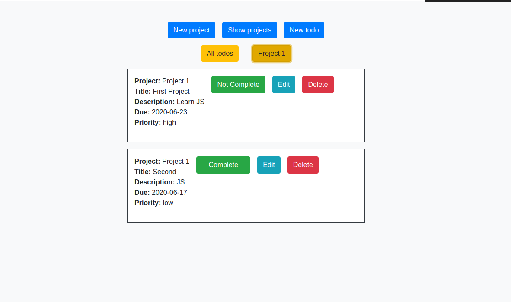

 

 

# Todo list (Javascript)
This is a Todo List created with Javascript.

## The look of the User Interface

When you open the app, you will see three buttons
- New Project: You can create a new Project
- New Todo: You can create a new Todo and Associate a project to it
- Show Project: A list of all Projects is desplayed and the todo for each project with the edit and delete buttons

## Screenshot

## Live Demo

[Click for live webpage](https://polar-coast-33464.herokuapp.com/)

## Built With

- JavaScript
- HTML5 
- Bootstrap
- scss

## Requirements

- Keep your code clean.
- Do not commit console.log to your repo. - It’s ugly, it kills performance and it can make confidential data be visible in the browser tools.
- Keep the number of changes/updates to the DOM as low as possible, they are very expensive for the browser.
- Keep the application logic separated from DOM manipulation tasks.
- Keep all the styling logic in CSS files.
- Use object destructuring to get the values from an object. This way you can avoid repeating a lot of code.

### Setup

- Clone the repository on your local machine
- Cd into the folder
- Run `npm install`
- Run `npm run dev`

### Install

- Install VSCode or any code editor you like

## Authors

👤  **Murilo Roque**

- Github: [@muriloroque](https://github.com/MuriloRoque)
- Twitter: [@MuriloRoquePai1](https://twitter.com/MuriloRoquePai1)
- Linkedin: [MuriloRoque](https://www.linkedin.com/in/murilo-roque-b1268741/)

👤  **Theophile Kango**

- Github: [@githubhandle](https://github.com/Theophile-Kango)
- Twitter: [@twitterhandle](https://twitter.com/Theophadh)
- Linkedin: [linkedin](https://www.linkedin.com/in/theophile-kango)

## 🤝  Contributing

Contributions, issues and feature requests are welcome!

Feel free to check the [issues page](https://github.com/Theophile-Kango/js_tic_tac_toe/issues)
## Show your support

Give a ⭐️  if you like this project!
